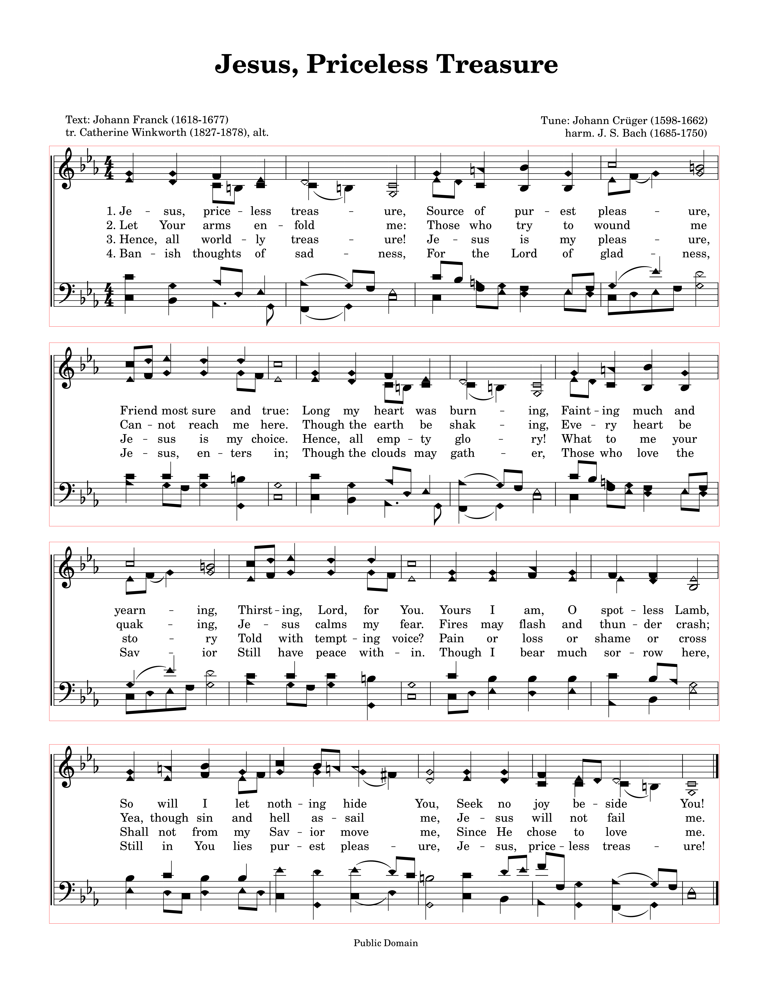

# Sheet Music Splitter Sample

You need pip and poetry for this project.

```bash
pip install poetry
```

Then you can run the following command to install the dependencies.

```bash
poetry install
```

## Sample

The sample file is `sample-pdf.pdf`

sample-dir is the sample output directory. This was generated with the following command
```bash
poetry run splitter images sample-pdf.pdf sample-dir --padding 5
```



## Image output sample

```bash
poetry run splitter images sheet-music-pdf.pdf temporary-dir --padding 4
```

This will create `temporary-dir` and save the split images there.

## Rectangle output sample

```bash
poetry run splitter rectangles sheet-music-pdf.pdf temporary-dir
```

This will create `temporary-dir` and save the work images there.
Then the rectangles will be output to stdout.

## Other Notes

If you wish to omit `poetry run` from your commands, you may use `poetry shell` to do so.

